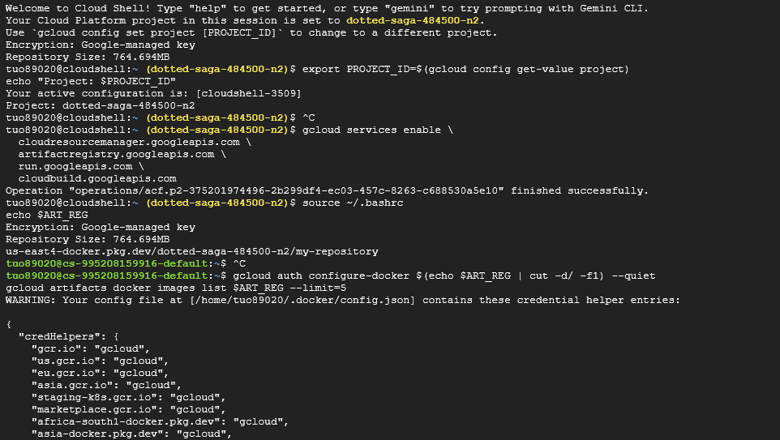

# Lab-5
Task 1: Environment Setup

This screenshot shows the successful cloning of the lab5-unit-conversion repository and that I made the python environment. The ls command confirms all required directories were present. The gcloud services enable command successfully enabled all required APIs. All foundational services necessary for deploying serverless containers were made.

Task 2: Generate gRPC Stubs from the Contract
These screenshots show the execution of `bash setup.sh` which runs the protoc compiler to generate Python gRPC stubs. The generated files are shown in both the conversion-engine and converter-api directories. This process enforces the service contract making sure that both services work together on data structure when compiling instead of when it hits runtime. 

Task 3: Building the Conversion Engine (Private gRPC Service)

These screenshots captures my initial failed deployment of the conversion-engine service to Cloud Run. The container built successfully but failed to start, with logs showing an ImportError: "cannot import name 'runtime_version' from 'google.protobuf'" – this indicated a version mismatch between the protobuf library installed in the container and the version used to generate the gRPC stubs. After examining the generated conversion_pb2.py file, I discovered it required protobuf 6.31.1, but my requirements.txt specified an older version. I consulted ChatGPT and DeepSeek to understand the error pattern, and they helped me recognize this as a classic dependency compatibility issue in containerized microservices.

The solution came from updating both services' requirements.txt files to specify "protobuf==6.31.1" alongside "grpcio==1.62.1", then regenerating the stubs and rebuilding the container as version v2. This resolved the import error because the runtime environment now matched exactly what the generated code expected. The successful deployment was confirmed when curling the conversion-engine URL returned a 403 Forbidden response – exactly what we want, proving the service is properly configured as private and requires authentication. This experience demonstrated how critical precise dependency management is in microservice architectures, where even minor version mismatches can prevent services from deploying or communicating correctly.

Task 4: Build the Converter API

This captures the successful build and deployment of the converter-api service. The `gcloud builds submit` command uploaded the source code to Cloud Build. During this process the command which built the container pushed it to Artifact Registry. The `gcloud run deploy` command created a new Cloud Run service making it publicly accessible from the internet. 

Task 5: Grant Service-to-Service Permissions

This screenshot shows the IAM policy binding that grants the converter-api permission to invoke the private conversion-engine. The `gcloud run services add-iam-policy-binding` command attaches the `roles/run.invoker` role to the service account for the conversion-engine. The verification command shows the binding was successfully added and the output confirmed the service account is authorized to call the private engine. This implements the zero-trust security model where the services have to prove identity rather than just relying only on network location which is more secure.
Task 6

Task 7
